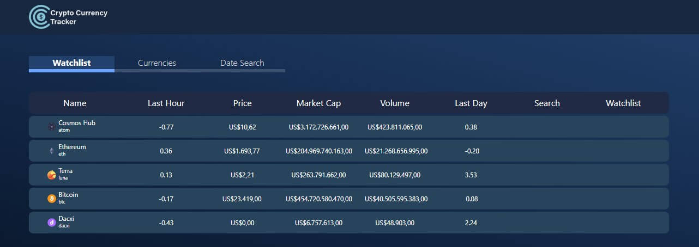

# Crypto Currency Tracker



> This repository will report about the Front-End part of the FullStack test to see the Backend Api report please [Acess This Link](https://github.com/MarcioVPires/api-crypto-currency-tracker)

## Installing

To install this project and run locally follow the steps bellow:

Download or Clone the repository:

```
git clone git@github.com:MarcioVPires/api-crypto-currency-tracker.git
```

Install the dependencies:

```
npm install
```

Run the project:

```
npm run
```

To configure a Local API please edit the api.js file inside src/services. Change the baseURL to your localhost.

# About the project

Creating this project was very awesome and challenging due to the fact I didn't knew Laravel and Vue, my stack includes node and react. But the most chalenging aspect was the time to complete: one week to learn Laravel and Vue and develop this project.

> I will show the basic usage of the project and in the end of this repo I will talk more about the steps to do the project
