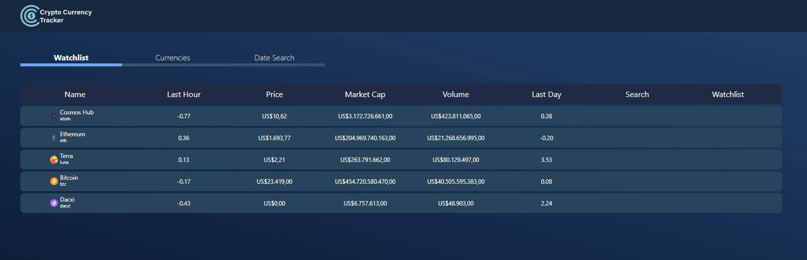
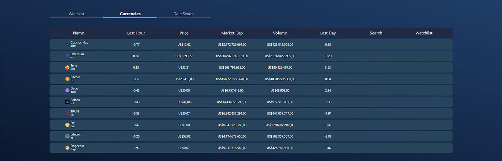
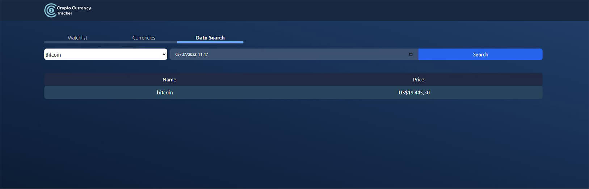

# Crypto Currency Tracker


> This repository will report about the Front-End part of the FullStack test to see the Backend Api report please [Acess This Link](https://github.com/MarcioVPires/api-crypto-currency-tracker)

## Installing

To install this project and run locally follow the steps bellow:

Download or Clone the repository:

```
git clone git@github.com:MarcioVPires/crypto-currency-tracker.git
```

Install the dependencies:

```
npm install
```

Run the project:

```
npm run serve
```

To configure a Local API please edit the api.js file inside src/services. Change the baseURL to your localhost.

### Functionalities

The app was design to have 5 functionalities:

1️⃣ **WatchList**
A section that only appears the coins you favorite

2️⃣ **Toggle Favorite**
The functionality to favorite or not any coin in the list

3️⃣ **Currencies**
A section shows the list of coins in the project api database

4️⃣ **Search**
A functionality that search for a coin in the list. Case the coin is not there, the project api will search in the coingecko api, save in the database's coins list and return the new list to the user.

5️⃣ **Search Price based on Date and Time**
A section with the functtionality to search for the price of a coin in the list in a given date and time.

> Unfortunately I could only deliver functionalities 1️⃣, 3️⃣ and 5️⃣ in the given time.

1️⃣ **WatchList**


&nbsp;
&nbsp;

3️⃣ **Currencies**


&nbsp;
&nbsp;

5️⃣ **Search Price based on Date and Time**


&nbsp;
&nbsp;

# About the project

Creating this project was very awesome and challenging due to the fact I didn't knew Laravel and Vue, my stack includes Node and React. But the most chalenging aspect was the time to complete: one week to learn Laravel and Vue and develop this project.

#### Steps

- Searched for apps with similar functionalities
- Prototyped a Layout on Figma
- Created a simple Logo
- Did a crash course on Vue
- Created the "skeleton" of the project with Vue
- Did a general search about Docker and orquestration with Swarm
- Did some tests with docker images: postgres and laravel
- Learned about the theory behind unity tests
- Learned how to create a laravel project with composer
- Watched lesson about middlewares, routing, controller helper functions in laravel

[⬆ Voltar ao topo](#nome-do-projeto)<br>
